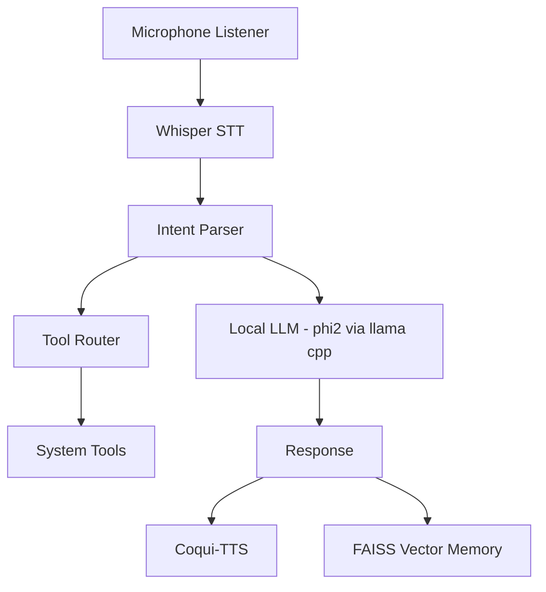
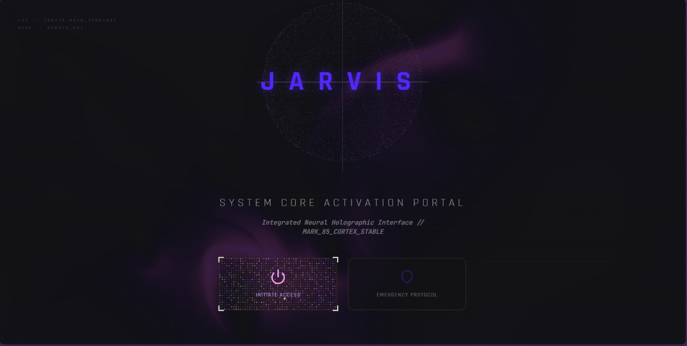
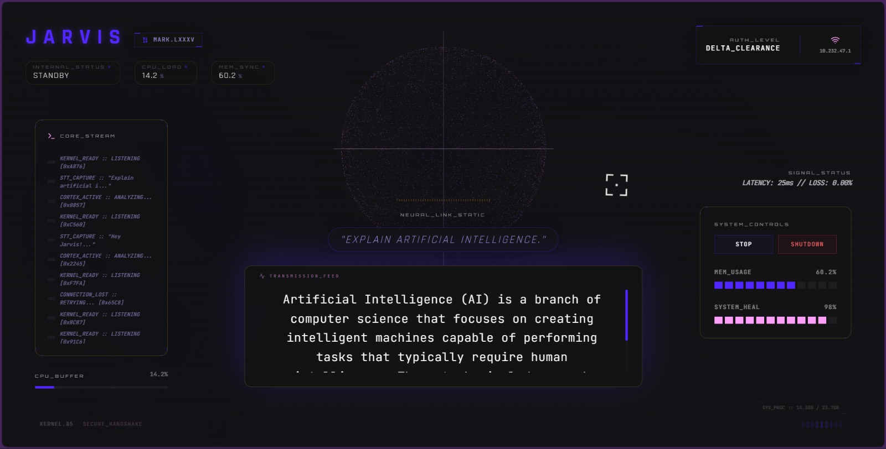
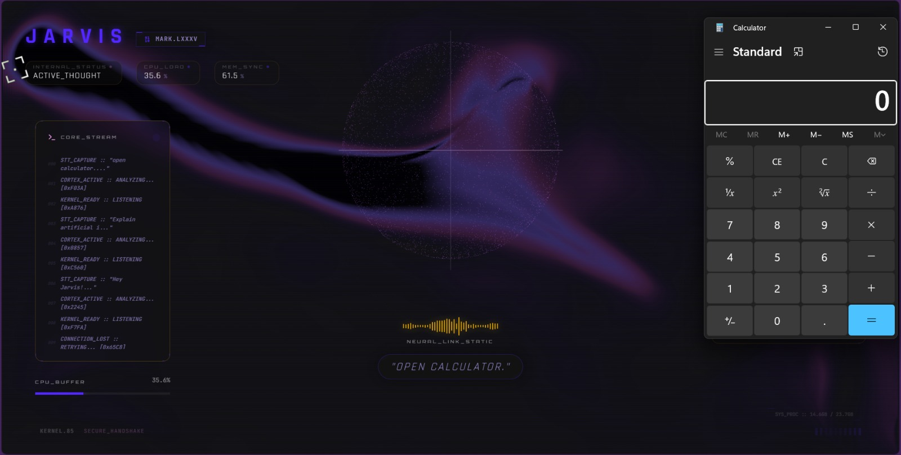

# 🛰️ JARVIS — Fully Local AI Assistant

<div align="center">


**"A voice-controlled AI system that lives inside your laptop — listens continuously, understands speech, remembers context, controls your computer, and talks back. All offline."**

</div>

---

## 🧭 What Is Jarvis?

Jarvis is a **fully-local AI automation system** built to behave like a personal digital operator. It runs **100% offline**, continuously listens for voice, converts speech to text, extracts intent, retrieves past memory, executes tools on your machine, and responds back with speech.

Unlike Alexa or Siri — Jarvis **does not depend on cloud**, does **not** send data anywhere, and **can actually control your PC**.

---

## 🎥 What Makes It Different

| Capability                     | Exists in Voice Assistants | Exists in Jarvis                        |
| ------------------------------ | -------------------------- | --------------------------------------- |
| Offline execution              | No                         | Yes                                     |
| Local speech-to-text           | Partially                  | Yes (Whisper CPU)                       |
| Long‑term memory               | No                         | Yes (FAISS vector DB)                   |
| Execute OS‑level commands      | Limited                    | Yes — open apps, volume, music, scripts |
| Continuous background listener | Yes                        | Yes                                     |
| Hackable / Extendable          | No                         | Yes (plugin toolbelt)                   |

---

## 🧬 Core System Flow

```
🎤 Microphone (always listening)
        ↓
🧏 Whisper STT → Text
        ↓
🧠 Intent Parser → Tool Router
        ↓
🔧 Tools (open apps, music, system commands)
        ↓
🧠 Local LLM (phi‑2‑GGUF via llama‑cpp)
        ↓
📝 Memory Engine (FAISS)
        ↓
🔊 Coqui‑TTS → Spoken audio reply
```

---

## 🏗️ Architecture Diagram



---

## 🧰 Major Components

### Voice + Speech Layer

* Whisper STT — CPU inference, high accuracy
* VAD — continuous background listening

### Brain Layer

* LLM — phi‑2‑GGUF via llama‑cpp
* Intent extraction → decides what Jarvis should do next

### Memory Layer

* FAISS vector DB → remembers context intelligently

### Action Layer

Tools capable of:

* Opening apps (Chrome, calculator, Bluetooth panel, etc.)
* Playing YouTube music
* Adjusting system volume
* Triggering Telegram automations
* Executing OS commands (PowerShell)

---

## 🚀 How to Run

### Backend Setup

```bash
git clone https://github.com/YeswanthRam28/Jarvis.git
cd Jarvis
python -m venv venv
venv/Scripts/activate
pip install -r requirements.txt
```

### Frontend HUD

```bash
cd ui
npm install
cd ..
./run_hud.ps1
```

---

## 🧾 Example Commands You Can Speak

```
"Hey Jarvis, open Spotify"
"Turn volume down"
"Play Interstellar soundtrack"
"Launch calculator"
"Send message to Telegram bot"
```

---

## 📎 Screenshots / Demonstration

  
  
  

---

## 📄 Operational License
Distributed under the MIT License. See LICENSE for more information.

`
Designed with precision. Built for intelligence.
`
